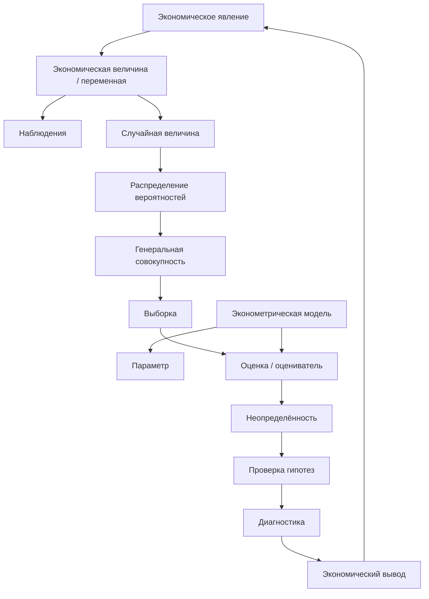
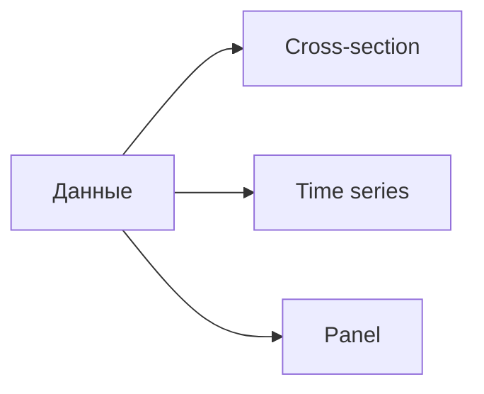
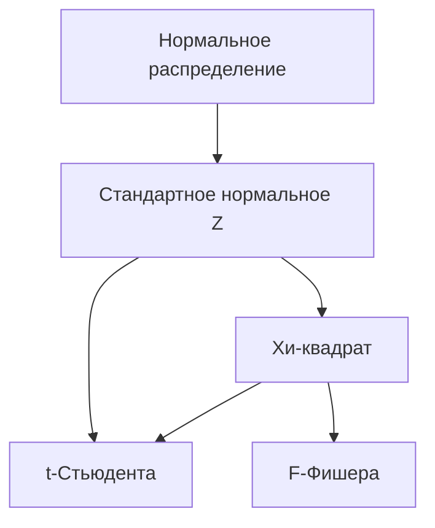
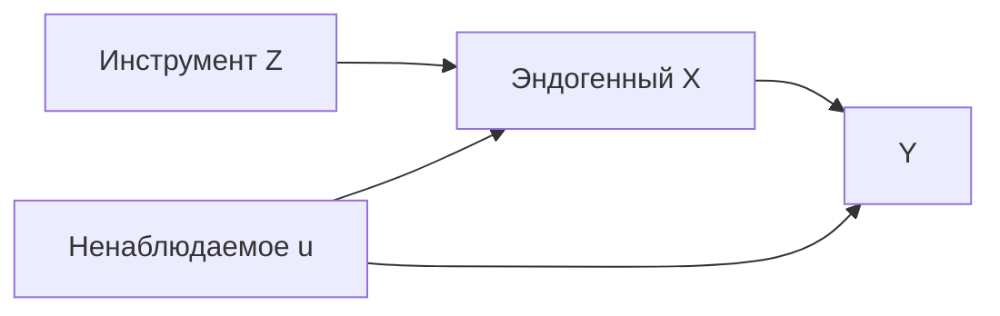
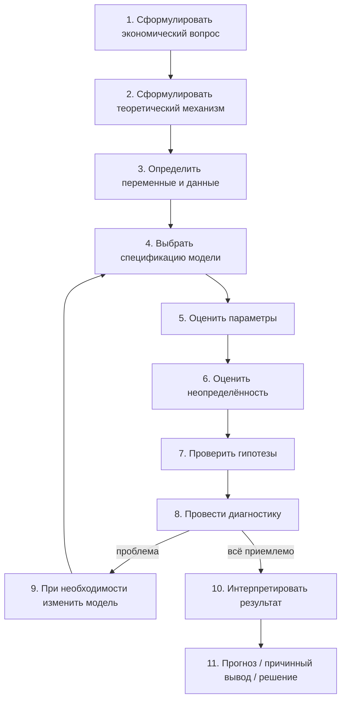

# Онтология эконометрии

> Это не «словарь определений ради определений», а карта предмета: **какие сущности существуют в эконометрии, как они связаны и какой вопрос решает каждая из них**.
>
> Основа структуры: Суслов В. И., Ибрагимов Н. М., Талышева Л. П., Цыплаков А. А. «Эконометрия» + текущий семинар МГУ по повторению теории вероятностей и математической статистики.

---

# 1. Эконометрия в одном предложении

**Эконометрия использует экономическую теорию, данные и вероятностно-статистические модели, чтобы количественно оценивать экономические связи, измерять неопределённость этих оценок, проверять гипотезы и строить прогнозы.**

Главная цепочка предмета:

Самая важная мысль: **мы почти никогда не наблюдаем интересующий параметр напрямую**. Мы видим данные и по ним пытаемся восстановить неизвестную закономерность.

---

# 2. Четыре мира, которые надо различать

В эконометрии постоянно взаимодействуют четыре уровня.

## 2.1. Экономическая реальность

Существуют реальные объекты и процессы:

- люди;
- фирмы;
- рынки;
- страны;
- цены;
- доходы;
- потребление;
- инвестиции;
- занятость;
- инфляция;
- выпуск и т. д.

На этом уровне возникают **экономические вопросы**:

> Как образование связано с зарплатой?
>
> Как изменение ставки процента связано с инвестициями?
>
> Как прошлые значения инфляции помогают прогнозировать будущую инфляцию?

## 2.2. Теоретическая модель

Экономическая теория формулирует предполагаемую связь между величинами.

Например:

$$
Y = f(X_1, X_2, \ldots, X_k).
$$

Теория говорит, **что с чем должно быть связано и почему**.

## 2.3. Вероятностная модель

Реальные наблюдения не лежат идеально на теоретической кривой. Поэтому появляется случайная компонента:

$$
Y = f(X_1,\ldots,X_k;\beta) + u.
$$

где:

- $\beta$ — неизвестные параметры связи;
- $u$ — случайное возмущение / ошибка модели.

## 2.4. Выборочные данные

Мы наблюдаем конечный набор реализаций:

$$
(y_i,x_{i1},\ldots,x_{ik}), \qquad i=1,\ldots,n.
$$

По этой выборке строятся оценки неизвестных параметров:

$$
\hat\beta.
$$

**Именно переход от данных к неизвестным параметрам — центральная задача эконометрии.**

---

# 3. Базовая онтологическая схема

---

# 4. Мир данных

## 4.1. Экономическая величина

Теоретическое количественное свойство экономического объекта: доход, цена, выпуск, капитал, ставка процента.

## 4.2. Статистический показатель

Операциональное определение экономической величины: **как именно её измерять**.

Это важно: теоретическое понятие и способ его измерения — не одно и то же.

## 4.3. Наблюдение

Конкретное измеренное значение переменной у конкретного объекта и/или в конкретный момент времени.

## 4.4. Переменная

Признак, который меняется между наблюдениями.

Частые роли:

- $Y$ — зависимая / результирующая переменная;
- $X$ — фактор / регрессор / объясняющая переменная;
- $u$ — ненаблюдаемая случайная составляющая.

## 4.5. Типы данных

### Пространственная выборка (cross-section)

Много объектов в один момент или период времени.

Пример: зарплаты 1000 работников в 2026 году.

### Временной ряд (time series)

Один объект или агрегат наблюдается во времени.

Пример: инфляция России по месяцам.

### Панельные данные (panel data)

Много объектов наблюдаются много периодов.

Пример: 500 фирм за 10 лет.

Связь:

---

# 5. Мир вероятности

Эконометрия рассматривает наблюдаемые экономические величины как реализации случайных величин.

## 5.1. Случайная величина

Величина, значение которой заранее неизвестно и описывается распределением вероятностей.

## 5.2. Распределение

Правило, описывающее, какие значения случайная величина может принимать и насколько они вероятны.

Ключевые объекты:

- функция распределения $F(x)$;
- плотность $f(x)$ для непрерывной случайной величины;
- вероятность $P(A)$.

## 5.3. Математическое ожидание

Центр распределения:

$$
E(X)=\mu.
$$

Интуитивно: среднее значение случайной величины в гипотетически бесконечном повторении эксперимента.

## 5.4. Дисперсия

Разброс относительно математического ожидания:

$$
\mathrm{Var}(X)=E[(X-E(X))^2].
$$

Стандартное отклонение:

$$
\sigma_X=\sqrt{\mathrm{Var}(X)}.
$$

## 5.5. Ковариация

Мера совместного линейного движения двух случайных величин:

$$
\mathrm{Cov}(X,Y)=E[(X-E(X))(Y-E(Y))].
$$

## 5.6. Корреляция

Нормированная ковариация:

$$
\rho_{XY}=\frac{\mathrm{Cov}(X,Y)}{\sigma_X\sigma_Y}.
$$

$$
-1\le \rho_{XY}\le 1.
$$

**Корреляция описывает линейную статистическую связь, но сама по себе не устанавливает причинность.**

## 5.7. Независимость

Более сильное свойство, чем нулевая корреляция.

Независимость $\Rightarrow$ нулевая ковариация (при существовании моментов), но обратное в общем случае неверно.

## 5.8. Условное математическое ожидание

Один из самых важных объектов всей эконометрии:

$$
E(Y\mid X).
$$

Это среднее значение $Y$ среди наблюдений с данным значением $X$.

**Регрессия в глубоком смысле моделирует именно условное ожидание $Y$ при известных $X$.**

---

# 6. Распределения, которые постоянно возникают

## 6.1. Нормальное распределение

$$
X\sim N(\mu,\sigma^2).
$$

После стандартизации:

$$
Z=\frac{X-\mu}{\sigma}\sim N(0,1).
$$

## 6.2. Хи-квадрат

Если $Z_1,\ldots,Z_\nu$ независимы и стандартно нормально распределены, то

$$
Q=\sum_{i=1}^{\nu} Z_i^2\sim\chi^2_\nu.
$$

## 6.3. Распределение Стьюдента

Если

$$
Z\sim N(0,1),
\qquad
Q\sim\chi^2_\nu
$$

независимы, то

$$
T=\frac{Z}{\sqrt{Q/\nu}}\sim t_\nu.
$$

Оно появляется, когда неизвестная дисперсия оценивается по выборке.

## 6.4. Распределение Фишера

Если $Q_1$ и $Q_2$ — независимые хи-квадрат величины, то

$$
F=\frac{Q_1/\nu_1}{Q_2/\nu_2}\sim F_{\nu_1,\nu_2}.
$$

Используется, в частности, для тестирования нескольких ограничений одновременно.

---

# 7. Генеральная совокупность и выборка

## Генеральная совокупность

Концептуальное множество всех возможных реализаций интересующего процесса.

Её характеристики — **параметры**:

- $\mu$;
- $\sigma^2$;
- $\rho$;
- $\beta$.

Они обычно неизвестны.

## Выборка

Наблюдаемый конечный набор данных:

$$
X_1,\ldots,X_n.
$$

По выборке вычисляются **статистики**:

- $\bar X$;
- $s^2$;
- $r$;
- $\hat\beta$.

Главное различие:

> **Параметр принадлежит генеральной совокупности. Статистика вычисляется по выборке.**

---

# 8. Оценивание

## 8.1. Параметр

Неизвестная характеристика модели.

Например, в

$$
Y_i=\beta_0+\beta_1X_i+u_i
$$

$\beta_1$ — истинная, но неизвестная величина.

## 8.2. Оцениватель

Правило / формула, по которой из случайной выборки получается оценка параметра.

Оцениватель сам является случайной величиной.

## 8.3. Оценка

Конкретное численное значение оценивателя после подстановки конкретных данных.

Например:

$$
\hat\beta_1=2.37.
$$

## 8.4. Свойства оценивателей

### Несмещённость

$$
E(\hat\beta)=\beta.
$$

В среднем оцениватель попадает в истинный параметр.

### Состоятельность

При росте выборки оцениватель приближается к истинному параметру:

$$
\hat\beta \xrightarrow{p} \beta.
$$

### Эффективность

Среди допустимых оценивателей предпочитается имеющий меньшую дисперсию.

---

# 9. Почему работают большие выборки

## Закон больших чисел

Объясняет, почему выборочные средние стабилизируются около математического ожидания:

$$
\bar X_n\xrightarrow{p}E(X).
$$

## Центральная предельная теорема

Объясняет, почему множество статистик после нормировки имеет приближённо нормальное распределение при большом $n$:

$$
\frac{\sqrt n(\bar X-\mu)}{\sigma}
\xrightarrow{d}N(0,1).
$$

Это один из главных мостов от теории вероятностей к статистическому выводу.

---

# 10. Регрессия — центральный объект эконометрии

## 10.1. Простая линейная регрессия

$$
Y_i=\beta_0+\beta_1X_i+u_i.
$$

Смысл сущностей:

| Объект | Что означает |
|---|---|
| $Y_i$ | наблюдаемая зависимая переменная |
| $X_i$ | наблюдаемый регрессор |
| $\beta_0$ | свободный член |
| $\beta_1$ | параметр связи $X$ и $Y$ |
| $u_i$ | ненаблюдаемое случайное возмущение |

Если

$$
E(u_i\mid X_i)=0,
$$

то

$$
E(Y_i\mid X_i)=\beta_0+\beta_1X_i.
$$

Вот почему линейная регрессия моделирует **условное среднее**.

## 10.2. Множественная регрессия

$$
Y_i=\beta_0+\beta_1X_{i1}+\cdots+\beta_kX_{ik}+u_i.
$$

или в матричной форме:

$$
y=X\beta+u.
$$

Коэффициент $\beta_j$ интерпретируется как изменение условного среднего $Y$ при изменении $X_j$ на единицу **при прочих равных**.

---

# 11. Метод наименьших квадратов (МНК / OLS)

МНК выбирает коэффициенты, минимизирующие сумму квадратов остатков:

$$
RSS=\sum_{i=1}^n e_i^2.
$$

где

$$
e_i=y_i-\hat y_i.
$$

В матричной форме:

$$
\hat\beta=(X'X)^{-1}X'y.
$$

Связи:

---

# 12. Ошибка и остаток — не одно и то же

Это одна из важнейших пар терминов.

## Ошибка / возмущение

$$
u_i=Y_i-E(Y_i\mid X_i).
$$

Теоретическая ненаблюдаемая величина.

## Остаток

$$
e_i=y_i-\hat y_i.
$$

Наблюдаемая после оценивания модели величина.

> **$u_i$ относится к истинной модели; $e_i$ — к оценённой модели.**

---

# 13. Предпосылки модели

Предпосылки — не формальная бюрократия. Они определяют, **что именно можно утверждать по результатам оценивания**.

## 13.1. Корректная спецификация

Модель должна адекватно описывать интересующую зависимость.

Нарушение: **misspecification / ошибка спецификации**.

## 13.2. Экзогенность

Ключевая форма:

$$
E(u\mid X)=0.
$$

Регрессоры не должны систематически содержать информацию о ненаблюдаемой ошибке.

Нарушение: **эндогенность**.

## 13.3. Отсутствие совершенной мультиколлинеарности

Регрессоры не должны быть точными линейными комбинациями друг друга.

Иначе $X'X$ необратима и стандартная МНК-формула не определена.

## 13.4. Гомоскедастичность

$$
\mathrm{Var}(u_i\mid X)=\sigma^2.
$$

Одинаковая условная дисперсия ошибки.

Нарушение: **гетероскедастичность**.

## 13.5. Отсутствие автокорреляции ошибок

Для разных наблюдений ошибки не должны быть систематически связаны в тех моделях, где это требуется:

$$
\mathrm{Cov}(u_i,u_j\mid X)=0, \qquad i\ne j.
$$

Нарушение: **автокорреляция**.

## 13.6. Нормальность ошибок

Нужна не для самой идеи МНК, а для некоторых точных маловыборочных выводов:

$$
u\mid X\sim N(0,\sigma^2I).
$$

---

# 14. Теорема Гаусса—Маркова

При классических предпосылках МНК-оценка является BLUE:

**Best Linear Unbiased Estimator** — лучшей линейной несмещённой оценкой.

Разложим слово:

- **Linear** — линейна по наблюдаемому $y$;
- **Unbiased** — несмещённа;
- **Best** — имеет минимальную дисперсию среди линейных несмещённых оценивателей.

---

# 15. Неопределённость оценки

Одной точки $\hat\beta$ недостаточно.

Нужно понимать, насколько она точна.

## 15.1. Дисперсия оценивателя

Показывает, насколько $\hat\beta$ менялась бы между гипотетическими повторными выборками.

## 15.2. Стандартная ошибка

$$
SE(\hat\beta)=\sqrt{\widehat{\mathrm{Var}}(\hat\beta)}.
$$

**Стандартное отклонение данных** и **стандартная ошибка оценки** — разные вещи.

## 15.3. Доверительный интервал

Типовая форма:

$$
\hat\beta_j \pm c\cdot SE(\hat\beta_j).
$$

где $c$ — соответствующее критическое значение.

---

# 16. Проверка статистических гипотез

Типовая гипотеза:

$$
H_0:\beta_j=0,
\qquad
H_1:\beta_j\ne0.
$$

## 16.1. t-статистика

$$
t=\frac{\hat\beta_j-\beta_{j,0}}{SE(\hat\beta_j)}.
$$

Она отвечает на вопрос:

> Насколько далеко оценка находится от значения, заданного нулевой гипотезой, **в единицах своей стандартной ошибки**?

## 16.2. p-value

Вероятность при справедливости $H_0$ получить статистику не менее экстремальную, чем наблюдаемая.

**p-value не является вероятностью того, что $H_0$ истинна.**

## 16.3. F-тест

Используется для проверки нескольких ограничений одновременно.

Пример:

$$
H_0:\beta_2=\beta_3=\beta_4=0.
$$

## 16.4. Ошибки решений

- ошибка I рода: отвергли истинную $H_0$;
- ошибка II рода: не отвергли ложную $H_0$.

---

# 17. Значимость: три разных понятия

Нельзя смешивать:

### Статистическая значимость

Достаточно ли велик эффект относительно статистической неопределённости?

### Экономическая значимость

Достаточно ли велик эффект по существу?

### Причинная значимость

Можно ли интерпретировать оценённую связь как причинный эффект?

Они не эквивалентны.

---

# 18. Корреляция, регрессия и причинность

Но стрелки здесь означают усложнение вопроса, а не логическое следствие.

## Корреляция

Есть ли линейное совместное движение двух переменных?

## Регрессия

Как меняется условное среднее $Y$ при изменении $X$ с учётом других включённых факторов?

## Причинность

Что произошло бы с $Y$, если бы мы **изменили $X$**, удерживая всё остальное релевантное неизменным?

Для причинного вывода обычно нужны дополнительные идентифицирующие предпосылки, дизайн исследования или специальные методы.

---

# 19. Главные поломки регрессии

| Проблема | Что нарушено / происходит | Почему опасно | Типичные направления решения |
|---|---|---|---|
| Гетероскедастичность | $Var(u_i\mid X)$ неодинакова | обычные стандартные ошибки могут быть неверны | робастные SE, WLS/GLS |
| Автокорреляция | ошибки связаны между периодами/наблюдениями | неверная оценка неопределённости, потеря эффективности | модели динамики, GLS, специальные SE |
| Мультиколлинеарность | регрессоры сильно линейно связаны | большие SE, нестабильные коэффициенты | больше данных, пересмотр спецификации |
| Эндогенность | $E(u\mid X)\ne0$ | МНК обычно смещён и несостоятелен | IV/2SLS, дизайн, контроль источника эндогенности |
| Ошибка измерения | переменная измерена с ошибкой | может искажать коэффициенты | IV, улучшение измерения, специальные модели |
| Ошибка спецификации | пропущены переменные / неверна форма | интерпретация и вывод могут быть неверны | пересмотр модели, тесты спецификации |

---

# 20. Инструментальные переменные

Используются прежде всего при эндогенности.

Инструмент $Z$ должен быть связан с эндогенным $X$, но не должен напрямую содержать ту часть ненаблюдаемого $u$, которая портит регрессию.

Смысл:

Мы ищем часть вариации $X$, приходящую извне через $Z$.

---

# 21. Качественные переменные

## Фиктивная переменная (dummy)

Переменная, обычно принимающая значения $0$ и $1$.

Позволяет включать категории в линейную регрессию.

## Бинарная зависимая переменная

Если $Y\in\{0,1\}$, часто используются:

- линейная модель вероятности;
- logit;
- probit.

---

# 22. Максимальное правдоподобие

Метод оценивания, выбирающий параметры, при которых наблюдённые данные наиболее правдоподобны в рамках выбранной вероятностной модели.

Функция правдоподобия:

$$
L(\theta\mid data).
$$

Оценка максимального правдоподобия:

$$
\hat\theta_{ML}
=
\arg\max_{\theta}L(\theta\mid data).
$$

Часто максимизируется логарифм:

$$
\ell(\theta)=\log L(\theta).
$$

---

# 23. Временные ряды

Во временных рядах порядок наблюдений принципиален.

## 23.1. Стационарность

Свойства вероятностного процесса не должны произвольно меняться во времени.

## 23.2. Автокорреляция

Связь ряда со своими прошлыми значениями.

## 23.3. Лаг

Прошлое значение:

$$
Y_{t-1},Y_{t-2},\ldots
$$

## 23.4. AR

Авторегрессия:

$$
Y_t=c+\phi Y_{t-1}+u_t.
$$

## 23.5. MA

Текущая величина зависит от текущих и прошлых шоков.

## 23.6. ARMA / ARIMA

Комбинации авторегрессии, скользящего среднего и интегрирования.

## 23.7. ARCH / GARCH

Модели динамики условной дисперсии — особенно важны для финансовой волатильности.

## 23.8. Единичный корень

Источник нестационарности; связан со стохастическим трендом.

## 23.9. Коинтеграция

Долгосрочная устойчивая связь между некоторыми нестационарными рядами.

## 23.10. VAR

Векторная авторегрессия: несколько временных рядов моделируются совместно через их лаги.

---

# 24. Причинность по Грейнджеру

$X$ «причиняет по Грейнджеру» $Y$, если прошлые значения $X$ содержат дополнительную прогностическую информацию о $Y$ после учёта собственной истории $Y$.

Это **прогностическое**, а не автоматически структурно-причинное понятие.

---

# 25. Байесовский слой

Байесовский подход рассматривает неизвестный параметр как объект вероятностного описания.

Схематически:

$$
posterior
\propto
likelihood\times prior.
$$

---

# 26. Словарь обозначений

| Обозначение | Обычно означает |
|---|---|
| $Y,y$ | зависимая переменная |
| $X,x$ | регрессор / матрица регрессоров |
| $\beta$ | истинный неизвестный параметр |
| $\hat\beta$ | оценка параметра |
| $u,\varepsilon$ | теоретическая ошибка / возмущение |
| $e,\hat u$ | остаток |
| $\hat y$ | предсказанное / fitted значение |
| $n,N$ | объём выборки |
| $k$ | число параметров / факторов / степеней свободы — зависит от контекста |
| $E(X)$ | математическое ожидание |
| $Var(X)$ | дисперсия |
| $Cov(X,Y)$ | ковариация |
| $Corr(X,Y)$ | корреляция |
| $\mu$ | математическое ожидание генеральной совокупности |
| $\sigma^2$ | дисперсия генеральной совокупности / ошибки |
| $s^2$ | выборочная оценка дисперсии |
| $SE(\hat\beta)$ | стандартная ошибка оценки коэффициента |
| $RSS$ | сумма квадратов остатков |
| $R^2$ | доля вариации $Y$, объяснённая регрессионной моделью в выборке |
| $H_0$ | нулевая гипотеза |
| $H_1$ | альтернативная гипотеза |
| $\alpha$ | уровень значимости (либо параметр — зависит от контекста) |

---

# 27. Пары, которые нельзя путать

| Не путать | Разница |
|---|---|
| Генеральная совокупность ↔ выборка | все потенциальные реализации ↔ наблюдаемый конечный набор |
| Параметр ↔ статистика | характеристика генеральной совокупности ↔ функция выборки |
| Оцениватель ↔ оценка | случайное правило ↔ полученное число |
| $\beta$ ↔ $\hat\beta$ | истинный параметр ↔ его выборочная оценка |
| Ошибка $u$ ↔ остаток $e$ | ненаблюдаемая ошибка истинной модели ↔ наблюдаемый остаток оценённой модели |
| Дисперсия данных ↔ дисперсия оценивателя | разброс наблюдений ↔ разброс оценки между выборками |
| Стандартное отклонение ↔ стандартная ошибка | разброс данных ↔ неопределённость оценки |
| Корреляция ↔ регрессия | симметричная мера линейной связи ↔ условная модель $Y$ через $X$ |
| Регрессия ↔ причинность | статистическая условная связь ↔ эффект вмешательства |
| Статистическая ↔ экономическая значимость | доказуемость отличия от нуля ↔ практический размер эффекта |
| $R^2$ ↔ качество причинной модели | объяснённая выборочная вариация ↔ корректность причинной интерпретации |
| Независимость ↔ нулевая корреляция | независимость сильнее; нулевая корреляция не гарантирует независимость |

---

# 28. Вопрос → нужное понятие

| Если вопрос звучит так… | Смотри понятия |
|---|---|
| «Каков средний уровень?» | математическое ожидание, выборочное среднее |
| «Насколько данные разбросаны?» | дисперсия, стандартное отклонение |
| «Движутся ли две величины вместе?» | ковариация, корреляция |
| «Как $Y$ связан с $X$?» | условное ожидание, регрессия |
| «Как оценить наклон линии?» | МНК, $\hat\beta$ |
| «Насколько точна оценка?» | дисперсия оценивателя, SE, доверительный интервал |
| «Есть ли статистически различимый эффект?» | $H_0$, t-тест, p-value |
| «Значимы ли несколько факторов вместе?» | F-тест |
| «Можно ли доверять стандартным ошибкам?» | гомоскедастичность, автокорреляция, robust SE |
| «Почему МНК может быть смещён?» | эндогенность, пропущенные переменные, ошибка измерения |
| «Можно ли говорить о причинности?» | идентификация, экзогенность, инструменты / дизайн |
| «Как прогнозировать во времени?» | стационарность, лаги, ARIMA / VAR |
| «Почему дисперсия меняется во времени?» | ARCH / GARCH |

---

# 29. Эконометрическое исследование как алгоритм

---

# 30. Каркас всего курса

По учебнику Суслова—Ибрагимова—Талышевой—Цыплакова предмет естественно раскладывается так:

```mermaid
flowchart TD
    ECONOMETRICS[Эконометрия]
    ECONOMETRICS --> STAT[Социально-экономическая статистика]
    ECONOMETRICS --> REG[Регрессионный анализ]
    ECONOMETRICS --> TS[Анализ временных рядов]
    ECONOMETRICS --> ADV[Эконометрия II]

    STAT --> MEAS[Измерения и данные]
    STAT --> DESC[Описательная статистика]
    STAT --> LINK[Первичный анализ связей]

    REG --> OLS[Линейная регрессия / МНК]
    REG --> ASS[Предпосылки]
    REG --> VIOL[Нарушения предпосылок]
    REG --> DUMMY[Dummy / logit / probit]
    REG --> IV[Инструментальные переменные]
    REG --> SIM[Системы уравнений]

    TS --> ST[Стационарность]
    TS --> ARIMA[ARIMA]
    TS --> GARCH[ARCH / GARCH]
    TS --> COINT[Единичные корни / коинтеграция]

    ADV --> TESTS[Классические тесты]
    ADV --> ML[Максимальное правдоподобие]
    ADV --> BAYES[Байесовские методы]
    ADV --> VAR[VAR / Йохансен]
```

---

# 31. Минимальное ядро языка эконометрики

Если пока выучить только 25 слов, это должны быть:

1. наблюдение;
2. переменная;
3. выборка;
4. генеральная совокупность;
5. случайная величина;
6. распределение;
7. математическое ожидание;
8. дисперсия;
9. ковариация;
10. корреляция;
11. условное математическое ожидание;
12. параметр;
13. оцениватель;
14. оценка;
15. регрессор;
16. зависимая переменная;
17. ошибка / возмущение;
18. остаток;
19. МНК;
20. стандартная ошибка;
21. доверительный интервал;
22. нулевая гипотеза;
23. t-статистика;
24. p-value;
25. экзогенность.

Если смысл этих слов связан в одну сеть, большая часть дальнейших формул перестаёт выглядеть как набор заклинаний.

---

# 32. Как будем развивать эту онтологию

Этот файл должен быть **живым**.

Для каждого нового понятия будем добавлять:

1. **Определение** — что это такое.
2. **Интуицию** — зачем оно нужно.
3. **Формулу** — математическое представление.
4. **Связи** — из каких понятий оно следует и к чему ведёт.
5. **Не путать с…** — ближайшие ложные аналоги.
6. **Типовую задачу** — где оно появляется на семинаре.
7. **Статус освоения** — насколько уверенно понятие используется.

Предлагаемые статусы:

- ⬜ термин незнаком;
- 🟨 узнаю термин;
- 🟦 могу дать определение;
- 🟩 понимаю связи и решаю типовые задачи;
- ⭐ могу объяснить другому.

---

# 33. Текущий фокус: Семинар 1

Сейчас первыми узлами, которые надо сделать зелёными, являются:

- случайная величина;
- функция распределения;
- плотность;
- генеральная совокупность;
- выборка;
- математическое ожидание;
- дисперсия;
- стандартное отклонение;
- ковариация;
- корреляция;
- нормальное распределение;
- $\chi^2$;
- $t$-распределение;
- $F$-распределение;
- квантиль;
- выборочное среднее;
- выборочная дисперсия;
- закон больших чисел;
- центральная предельная теорема;
- доверительный интервал.

Именно они образуют фундамент, на котором затем строятся МНК, стандартные ошибки, t-тесты и F-тесты.

---

## Главное, что должно остаться в голове

> **Экономическая теория задаёт вопрос и предполагаемую структуру связи. Данные дают конечную выборку. Вероятностная модель описывает неопределённость. Оценивание превращает выборку в оценку неизвестного параметра. Стандартная ошибка показывает точность оценки. Проверка гипотез помогает понять, насколько данные совместимы с определёнными утверждениями. Диагностика определяет, можно ли доверять используемой модели. Интерпретация возвращает математический результат обратно в экономический язык.**